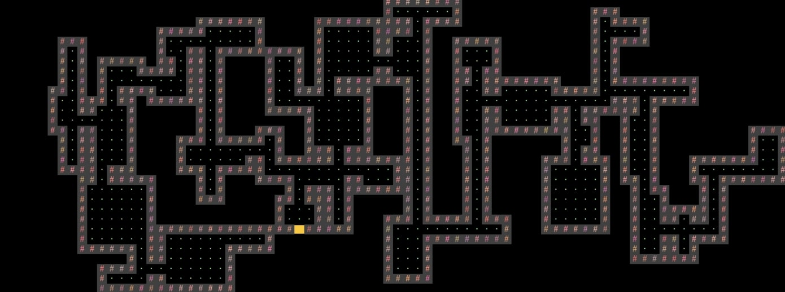

# Build Your Own Game 

Java project that calls for building a 2D tile based game. The basic premise is that each time a player starts a new game, a random world is generated with different rooms and hallways. 

Two players start moving their players through the hallways (similar to Pac Man visually) and the first player to reach the other side of the map wins. 

The game also implements a save and quit feature using Serialization. 
